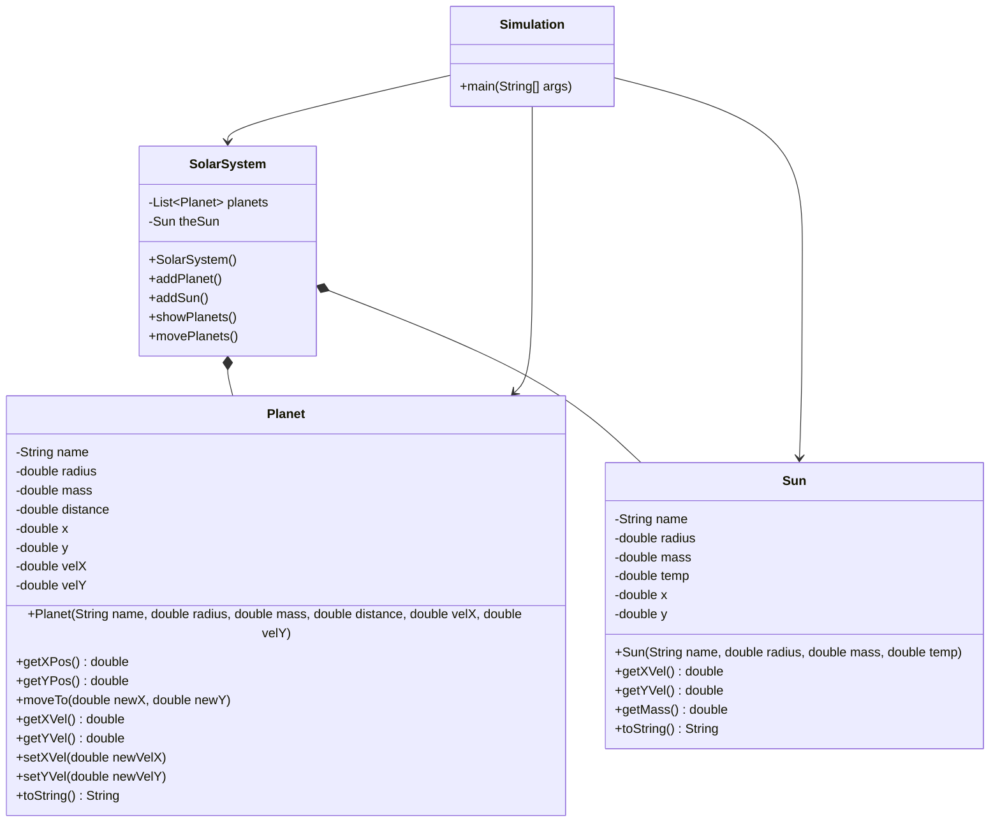

# Java-Lab-012 - Planets in Space

## Part 1 - English to Code

* In this part, we are going to learn to translate written English into the classes and objects that we'll need to build. Read the Paragraph below, and write down all the **NOUNS**, then re-read the paragraph and write down all the **ADJECTIVES**, and finally select all the **VERBS**. When done, move on to **Part 2**.

I want you to create a solar-system simulation where you can add planets and, of course, a sun. The simulation should be able to move the planets with respect to the sun's mass and size and, of course, gravity. The simulation should also be able to show where each planet is located at any given period. The Sun should be the center of the solar-system, so coordinate (0.0, 0.0). Each Planet should also have a coordinate position (hopefully not at 0.0, 0.0), a mass and size, and at any point I want to know its distance from its sun. Lastly, because this is a simulation, we should be able to move the planet and get and set its position and velocity.

## Part 2 - Class/Object Determination

* From your extraction of **NOUNS**, **ADJECTIVES**, and **VERBS** from the paragraph in Part 1, let's have a class discussion to decide what classes, objects, and actions are necessary for our simulation.

1. Nouns -> Become your classes and objects.
2. Adjectives -> Become the instance variables of your classes and objects.
3. Verbs -> Become the actions / methods of your classes and objects.

* From past class discussions, here is an example of the parts of speech extracted from the paragraph above.

| Nouns        | Adjectives          | Verbs |
| :---         | :----:              | ---:  |
| Planet       | mass                | move  |
| Simulation   | distance            | set   |
| Solar System | position/coordinate | get   |
| Sun          | velocity            | add   |
| Gravity      | name                | show  |

* From the noun extraction, you will create Java classes for: Planet, Sun, Solar System, and Simulation
* When you apply the adjectives to the nouns they describe and/or look for object relationships in the nouns, you'll end up with something like this:
    * Planet: name, mass, distance, position (x, y), velocity (x, y)
    * Sun: name, mass, position (x, y)
    * Solar System: theSun, planet(s)
    * Simulation: aSolarSystem, theSun, planets

* Finally when you apply the verbs to the nouns performing the actions you'll end up with something like this:
    * Planet: move, get/set position (x, y), get/set velocity (x, y)
    * Sun: get/set position (x, y), get mass
    * Solar System: add planet/sun, show planets, move planets

* From this simple English-parts to Object breakdown, a bit of discussion should lead to UML that looks a bit like this:
    * View this mermaid graph by pasting it into [Mermaid Live](https://mermaid.live/)



<object data="solarsystemsim.svg" width="700" height="700"> </object>


## Part 3 - Implementation

* From the plan created in Part 2, implement the classes and methods necessary for our simulation.
* When you get to the SolarSystem movePlanets method you may use the following implementation as your guide (HINT: your sun might not be named theSun):
```java
    public void movePlanets() {
        double G = 0.1;
        double dt = 0.001;

        for(Planet p : this.planets) {
            p.moveTo(p.getXPos() + dt * p.getXVel(),
                    p.getYPos() + dt * p.getYVel());

            double rx = this.theSun.getXPos() - p.getXPos();
            double ry = this.theSun.getYPos() - p.getYPos();
            double r = Math.sqrt(Math.pow(rx, 2) + Math.pow(ry, 2));

            double accX = G * this.theSun.getMass() * rx / Math.pow(r, 3);
            double accY = G * this.theSun.getMass() * ry / Math.pow(r, 3);

            p.setXVel(p.getXVel() + dt * accX);
            p.setYVel(p.getYVel() + dt * accY);
        }
    }
```
* Do your best to understand how this method works. I will release a video later in the week explaining exactly what it does and the mathematics behind it, but I want you to try to interpret it before my reveal.

## Part 4 - Turn In

* Do the same thing you do every week!
